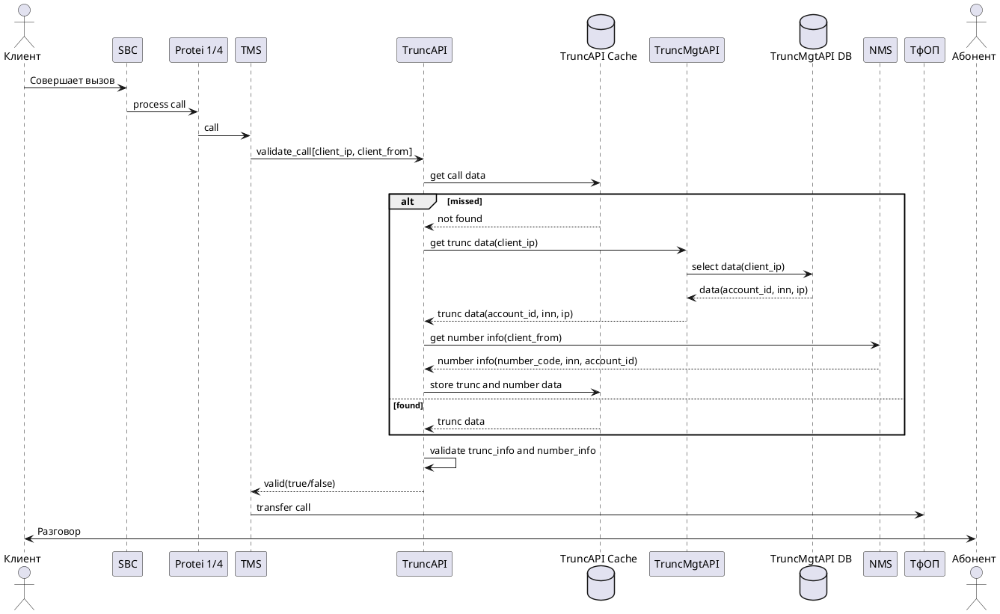

# ADR-0001: Архитектура TrunkMgtSystem

- Статус: Принято
- Дата: 2026-05-28
- Владелец: Бухотецкий Дмитрий
- Компонент: `global/components/TrunkMgtSystem`

## Контекст

Услуга - VOIP, исходящая связь. Проект - Exolve LA (Гнездо), Классический VOIP.

Клиент подключается к МТТ по Static IP (Porta, Онима) или по SIP ID (в рамках Porta), покупает номера и совершает звонки с поднятого SIP подключения на номера ТФОП.

### Текущая ситуация

Клиент МТТ в рамках биллинга Porta, при определенных настройках, может звонить с номеров, которых нет на ЛС;
Клиент МТТ в рамках биллинга Onyma, может звонить с номеров которых нет на ЛС, какого-либо контроля пропуска А-номеров с ЛС клиента - нет;
Клиент МТТ в рамках биллинга Porta и Onyma может иметь несколько ЛС, например номера живут на ЛС в Porta + там же настроена маршрутизация входящих вызовов. Исходящие вызовы клиент совершает в рамках ЛС c биллингом Онима, с SIP подключения по Static IP, при этом подставляет А-номера с ЛС, которые находятся на ЛС в Porta. Или иметь 2 ЛС в Porta c номерами, при этом у клиента есть возможность подставлять при исходящих звонках с одного ЛС номера как с этого ЛС, так и с другого (при определенных настройках);
Агентская схема - трафик сервиса Агента идет по одному ЛС, номера живут на ЛС конечного пользователя Клиента-Агента.

### Проблематика

Отсутствует контроль подставляемых А-номеров МТТ, при исходящих звонках с SIP подключений клиентов;
При проведении ОРМ вызов может быть не идентифицирован по принадлежности к ЛС/Клиенту. Номер может быть в статусе free, быть в карантине; 
При проведении ОРМ вызов может быть некорректно идентифицирован по принадлежности к ЛС/Клиенту. Как пример - прошлый владелец номера отключил номер, номер был удален с ЛС в биллинге (Porta/Онима), при этом владелец забыл его удалить с своего VOIP оборудования и продолжил подставлять в качестве А-номера. Номер продали новому клиенту, добавили на ЛС, клиент начал совершать исх. вызовы с данного номера. В итоге оба Клиента совершают исходящие вызовы с одного и того же номера.
В рамках ОРМ от МВД может поступить запрос на блокировку определенного номера Клиента. На текущий момент нет штатных средств для блокировки номера, как в схемах с Porta, так и в схемах с биллингом Онима.
МАВ/Маркировка - тарификация, счет за звонки выставляется не тому клиент.

### Риски

не выполнение предписания правохранительных органов по блокировке звонков и риски с этим связанные;
жалобы со стороны клиентов/владельцев нумерации, что с их номеров кто-то звонит.
штрафы за звонок с номера - от людей, регулятора, которого нет ни на одном ЛС или ошибочно находится на платформе ((АПК Карусель/др ЛС счете)/оборудовании клиента (не удалил по какой-то причине).

### Требования

- хранить и обслуживать trunk-данные для внешних систем;
- поддерживать быстрый онлайн-доступ при валидации вызова;
- выполнять fallback в источник данных при отсутствии кэша;
- получать номерные атрибуты через `NMS API` и связывать их с trunk-контекстом;
- поддерживать асинхронную синхронизацию данных через очередь сообщений.

### Ключевые ограничения

- высокая надежность и низкая задерка при онлайн обработке вызова <100ms;
- необходимость масштабирования по чтению.

## Решение

TrunkMgtSystem обеспечивает управление trunk-данными и их использование в онлайн-проверке вызовов на критическом тракте телефонии.

По материалам сервисного каталога (концепт и базовый call flow) система должна:
Архитектура TrunkMgtSystem разделяется на контур управления, контур онлайн-чтения и контур асинхронной синхронизации:

1. `TrunkMgtAPI` (Go) — контур управления trunk-данными.
2. `TrunkMgtDB` (PostgreSQL) — системная запись trunk-данных.
3. `DataForCache` (Kafka/Redpanda) — шина событий изменения trunk-данных.
4. `NumberWorker` (Go) — потребитель событий и синхронизатор данных в runtime-контур.
5. `TrunkAPI` (Go) — онлайн API валидации/резолвинга для `TMS`.
6. `TrunkAPIDB` (Redis) — низколатентный runtime-кэш для `TrunkAPI`.

```plantuml
@startuml
!NEW_C4_STYLE=1
!include https://raw.githubusercontent.com/plantuml-stdlib/C4-PlantUML/master/C4_Container.puml
SHOW_PERSON_OUTLINE()
' Tags support no spaces in the name (based on the underlining stereotypes, which don't support spaces anymore). 
' If spaces are requested in the legend, legend text with space has to be defined
AddElementTag("backendContainer", $fontColor=$ELEMENT_FONT_COLOR, $bgColor="#335DA5", $shape=EightSidedShape(), $legendText="backend container (eight sided)")
AddRelTag("async", $textColor=$ARROW_FONT_COLOR, $lineColor=$ARROW_COLOR, $lineStyle=DashedLine())
AddRelTag("sync/async", $textColor=$ARROW_FONT_COLOR, $lineColor=$ARROW_COLOR, $lineStyle=DottedLine())

' External Systems
System_Ext(Protei14, "Protei 1/4", "Software System", $sprite="system")
System_Ext(TMS, "TMS System", "Software System", $sprite="system")
System_Ext(TFOP, "ТФОП", "Software System", $sprite="system")
System_Ext(ExolveLKR, "Exolve LKR", "Software System", $sprite="system")
System_Ext(ExolveLKM, "Exolve LKM", "Software System", $sprite="system")
System_Ext(RDS_API, "RDS API", "Number Mgt System\n[Container: Golang]", $sprite="system")
System_Ext(NMS_API, "NMS API", "Number Mgt System\n[Container: Golang]", $sprite="system")

' System Boundary
System_Boundary(TrunkMgtSystemBoundary, "TrunkMgtSystem") {
    
    Container(TrunkMgtAPI, "Trunk Mgt API", "Container: Golang", "", $sprite="container")

    ContainerDb(TrunkMgtDB, "Trunk Mgt DB", "Container: PostgreSQL", "AccountID/TrunkID/ExtimalIP/Application(*)/\nSource/InternalIP/InternalPort(*)/\nDescription(*)/CPS(*)/SL(*)", $sprite="database")
    ContainerDb(TrunkAPIDB, "Trunk API DB", "Container: Redis", "Replica + sentinel", $sprite="database")
    Container(TrunkAPI, "Trunk API", "Container: Golang", "", $sprite="container")
    Container(NumberWorker, "Number Worker", "Container: Golang/Spine", "", $sprite="worker")
    ContainerDb(SyncStorage, "Sync storage data", "Container: Redis", "Store task process data")
    ContainerQueue(DataForCache, "Data for cache", "Container: Apache Kafka/Redpanda", "")

    Rel(TrunkMgtAPI, TrunkMgtDB, "Operate with data", "")
    Rel(TrunkMgtAPI, DataForCache, "Added trunk data", "")
    Rel(TrunkMgtAPI, TrunkAPI, "Get data by IP", "")
    Rel(TrunkAPI, TrunkAPIDB, "Store trunc data", "")
    Rel(NumberWorker, DataForCache, "Added trunk data", "")
    Rel(NumberWorker, TrunkAPI, "Add numbers data", "")
    Rel(NumberWorker, SyncStorage, "Syncing progress", "")
}

' External Relationships
Rel(Protei14, TMS, "Call", "")
Rel(TMS, TFOP, "Call", "")
Rel(TMS, TrunkAPI, "Get data", "")

Rel(ExolveLKR, TrunkMgtAPI, "Operate data", "")
Rel(ExolveLKM, TrunkMgtAPI, "Operate data", "")

Rel(TrunkAPI, RDS_API, "Get LC by number", "")
Rel(NumberWorker, NMS_API, "get numbers by lc\n[GetCustomerNumbers]", "")

@enduml
```

## Обоснование выбора технологий

### PostgreSQL как source of truth

- транзакционная целостность для операций управления trunk-данными;
- удобство схемной эволюции и индексации под ключевые запросы (`client_ip`, `account_id`);
- зрелые инструменты бэкапа, репликации и наблюдаемости.

### Redis как runtime-кэш

- минимальная задержка на чтение для валидации вызовов;
- снижение нагрузки на `TrunkMgtAPI`/PostgreSQL;
- возможность TTL/инвалидации для управляемой актуальности данных.

### Kafka/Redpanda как event backbone

- декуплинг записи и доставки изменений в runtime-контур;
- масштабируемое асинхронное распространение изменений;
- возможность повторного проигрывания событий для восстановления кэша.

## Целевой поток обработки вызова

Базовый call flow из вызова:



## Архитектурные принципы

- `TrunkMgtDB` — источник истины по trunk-данным.
- `Redis` — производный runtime-слой, допускающий кратковременную eventual consistency.
- Изменения trunk-данных публикуются как события в `Kafka/Redpanda`.
- `NumberWorker` отвечает за доставку изменений в runtime-контур и устойчивость синхронизации.
- TrunkAPI - построен с  использованием двухуровневой системы кеширования, L1 - Ristretto, L2 - Redis.
- Онлайн-тракт должен оставаться работоспособным при деградации отдельных интеграций (через кэш и контролируемый fallback).

## Последствия

### Позитивные

- низкая задержка на онлайн-валидации вызовов;
- горизонтальное масштабирование `TrunkAPI` и `NumberWorker`;
- снижение связности между контуром управления и онлайн-контуром;
- единый Go-стек для сервисной логики и операционного сопровождения.

### Негативные / компромиссы

- усложнение эксплуатации из-за событийной шины и нескольких хранилищ;
- необходимость контроля консистентности между PostgreSQL и Redis;
- логика формирования ключей для хранилица в нескольких местах;
- дополнительные сценарии отказов (лаг consumer-групп, устаревший кэш, недоступность NMS API).

## Нефункциональные требования и эксплуатация

- SLA онлайн-валидации: приоритет времени ответа `TrunkAPI` и стабильности fallback-маршрута.
- Наблюдаемость:
  - метрики latency/error rate для `TrunkAPI`, `TrunkMgtAPI`, `NumberWorker`;
  - лаг consumer-групп Kafka/Redpanda;
  - hit/miss rate Redis и время обновления кэша;
  - трассировка цепочек `TMS -> TrunkAPI -> TrunkMgtAPI/NMS`.
- Надежность:
  - retry с backoff для `NMS API` и межсервисных вызовов;
  - идемпотентная обработка событий в `NumberWorker`;
  - политики деградации при недоступности внешних систем.

## Рассмотренные альтернативы

1. Только синхронный путь без Redis и event-шины
  Отклонено: не обеспечивает требуемое время ответа и увеличивает нагрузку на контур управления.
2. Хранить runtime-данные только в PostgreSQL
  Отклонено: хуже профиль latency/throughput для частых операций чтения в онлайн-тракте.
3. Положить данные о транках в существующее хранилище номеров NMS
  Отклонено: понижает надёжность системы, увеличивает время обработки вызова, усложняет поддержку.

## Связанные артефакты
