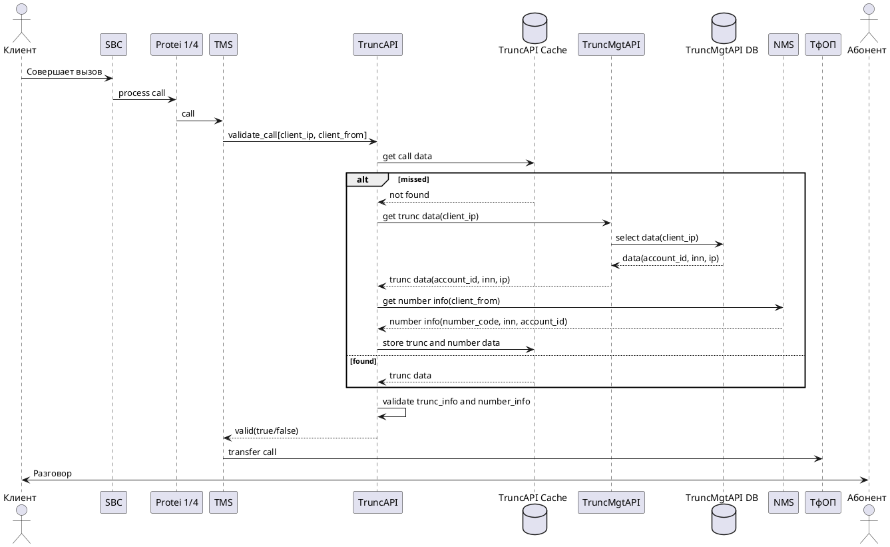

# Basic call flow

```plantuml
@startuml
actor Клиент as m
participant "SBC" as sbc
participant "Protei 1/4" as protei

participant "TMS" as tms
participant "TruncAPI" as tapi
Database "TruncAPI Cache" as tapic
participant "TruncMgtAPI" as tmapi
Database "TruncMgtAPI DB" as tmapidb
participant "NMS" as nms
participant "ТфОП" as tfop
actor Абонент as a

m -> sbc : Совершает вызов
sbc -> protei: process call
protei -> tms: call
tms -> tapi: validate_call[client_ip, client_from]
tapi -> tapic: get call data


alt missed
tapic --> tapi: not found
tapi -> tmapi: get trunc data(client_ip)
tmapi->tmapidb: select data(client_ip)
tmapidb --> tmapi: data(account_id, inn, ip)
tmapi-->tapi: trunc data(account_id, inn, ip)
tapi->nms: get number info(client_from)
nms-->tapi: number info(number_code, inn, account_id)
tapi->tapic: store trunc and number data
else found
tapic-->tapi: trunc data
end
tapi -> tapi: validate trunc_info and number_info
tapi --> tms: valid(true/false)
tms -> tfop: transfer call

m <-> a: Разговор
@enduml
```
